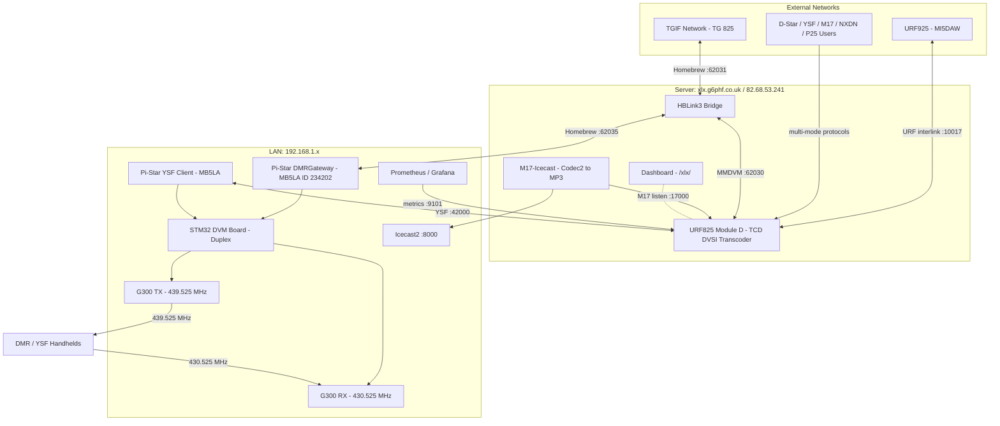

# URF825 Network Setup — G6PHF

## Overview

URF825 is a multimode amateur radio reflector operated by G6PHF (Mike), hosted at `xlx.g6phf.co.uk` (82.68.53.241). It bridges D-Star, DMR, YSF, NXDN, P25, and M17 modes via a transcoded Module D, and connects to the local MB5LA duplex repeater and the TGIF DMR network.

---

## Network Diagram




---

## Components

### URF825 Reflector (Docker: `urfd`)

| Item | Value |
|---|---|
| Host | xlx.g6phf.co.uk / 82.68.53.241 |
| Container IP | 172.20.0.4 (static) |
| Dashboard | http://xlx.g6phf.co.uk/xlx/ |
| Operator | G6PHF |
| Modules | D (transcoded), M (M17), S (D-Star), Z (temp) |
| Transcoder | TCD with DVSI DV3000/DV3003 USB hardware |
| Interlink peer | URF925 (MI5DAW) on Module D |

**Module D** is the main multimode chat module. It is fully transcoded — all modes (D-Star, DMR, YSF, NXDN, P25, M17) can hear each other via the DVSI hardware transcoder.

---

### HBLink3 Bridge (Docker: `hblink3`)

Bridges DMR traffic between TGIF TG 825 and URF825 Module D.

| System | Type | Details |
|---|---|---|
| TGIF | Peer | tgif.network:62031, Callsign MB5LA, ID 234202, TG 825 |
| URFD-D | XLX Peer | 172.20.0.4:62030 (container direct), Module D |
| MB5LA-REPEATER | Master | 0.0.0.0:62035, accepts ID 234202, TG 825 |

**Audio routing:** Radio TX (TG 825, TS1) → HBLink3 → TGIF (TG 825, TS1) + URF825 (TG 9, TS2)

**Important:** HBLink3 runs on the **host network** (not Docker bridge) to preserve source port 54002. URF825 uses the source port to identify HBLink3 as a client.

---

### MB5LA Duplex Repeater (Pi-Star)

| Item | Value |
|---|---|
| Callsign | MB5LA |
| DMR ID | 234202 |
| Software | Pi-Star with MMDVMHost |
| Hardware | STM32 RB_STM32_DVM board (firmware 20221121) |
| TX Radio | Motorola G300 — 439.525 MHz |
| RX Radio | Motorola G300 — 430.525 MHz |
| Colour Code | CC1 |
| Active modes | DMR (via HBLink3), YSF (direct to URF825) |

**DMR path:** 878/radio → 430.525 MHz → G300 RX → STM32 → Pi-Star DMRGateway → HBLink3 (:62035) → TGIF + URF825 Module D

**YSF path:** FT3/radio → 430.525 MHz → G300 RX → STM32 → Pi-Star → URF825 YSF (:42000) → Module D

**Inbound (network → radio):** URF825 Module D → HBLink3 → Pi-Star DMRGateway → STM32 → G300 TX → 439.525 MHz → handheld radio

---

### M17 Icecast Stream (Docker: `m17-icecast`)

Listens on URF825 Module D via M17 protocol, decodes Codec2 audio, and streams as MP3 to Icecast.

| Item | Value |
|---|---|
| Callsign | G6PHFL |
| Module | D |
| Stream | 192.168.1.62:8000/nwmg-stream.mp3 |
| Bitrate | 32 kbps MP3 |

---

## Key Configuration Files

| File | Location | Purpose |
|---|---|---|
| urfd.ini | docker/config/urfd.ini | Reflector main config |
| tcd.ini | docker/config/tcd.ini | Transcoder config |
| urfd.interlink | docker/config/urfd.interlink | URF925 peer |
| hblink.cfg | ../hblink3/docker/config/hblink.cfg | HBLink3 systems |
| rules.py | ../hblink3/docker/config/rules.py | Bridge routing rules |
| /etc/dmrgateway | Pi-Star | DMRGateway networks config |
| /etc/mmdvmhost | Pi-Star | MMDVMHost modem/mode config |

---

## Known Issues & Notes

### Pi-Star Config Regeneration
Pi-Star overwrites `/etc/dmrgateway` on every web UI save, replacing HBLink3 settings with BM defaults. **Fix:** make the file immutable after configuring correctly:
```bash
rpi-rw
sudo chattr +i /etc/dmrgateway
# To edit later: sudo chattr -i /etc/dmrgateway
```

### iptables Rule for HBLink3
Pi-Star's firewall blocks outbound UDP to non-standard ports. The rule allowing port 62035 was added and persisted:
```bash
sudo iptables -I OUTPUT -p udp -d 192.168.1.151 --dport 62035 -j ACCEPT
# Persisted via: sudo apt-get install iptables-persistent
```

### STM32 TX Level Calibration
The physical TX pot on the STM32 board must be adjusted for correct DMR deviation into the G300 TX radio. Default Pi-Star software `DMRTXLevel` does not affect the output level on this hardware — only the physical pot does. YSF is more tolerant of wrong levels; DMR requires correct deviation.

### HBLink3 Static Container IP
The `urfd` container has a static IP (172.20.0.4) via Docker IPAM config. HBLink3's `MASTER_IP` in `hblink.cfg` depends on this. Do not change the container IP without updating HBLink3.

### DMR ID Note
- **234202** — MB5LA repeater DMR ID (used in HBLink3 and Pi-Star DMRGateway)
- **2340160** — G6PHF personal DMR ID (used in MMDVM `Id=` field for RF identification)

---

## Docker Stack Commands

```bash
# URF825 reflector + dashboard
cd /home/mike/source/2urfd/docker
docker compose up -d

# HBLink3 bridge
cd /home/mike/source/hblink3/docker
docker compose up -d

# M17 Icecast stream
cd /home/mike/source/m17-icecast
docker compose up -d

# Metrics (optional)
cd /home/mike/source/2urfd/docker
docker compose --profile metrics up -d
```

## Useful Log Commands

```bash
# URF825 reflector logs
docker compose -f /home/mike/source/2urfd/docker/docker-compose.yml logs -f urfd

# HBLink3 bridge logs (watch live traffic)
docker compose -f /home/mike/source/hblink3/docker/docker-compose.yml logs -f hblink3

# Pi-Star MMDVMHost log (on Pi-Star via SSH)
sudo tail -f /var/log/pi-star/MMDVM-$(date +%Y-%m-%d).log

# Pi-Star DMRGateway log (on Pi-Star via SSH)
sudo tail -f /var/log/pi-star/DMRGateway-$(date +%Y-%m-%d).log
```
